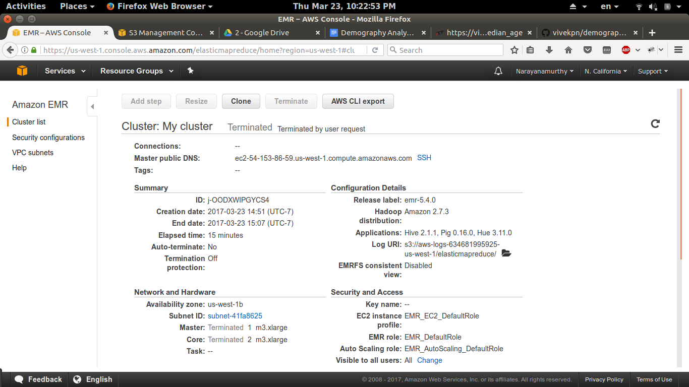
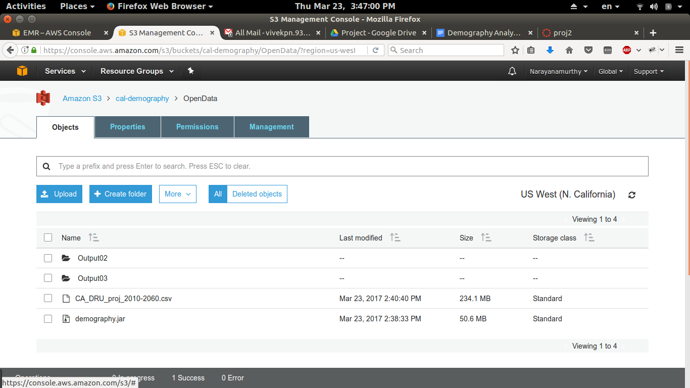
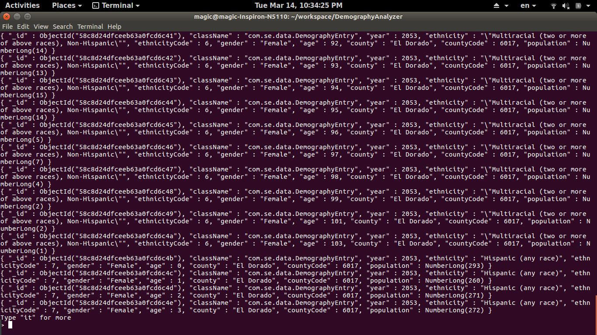
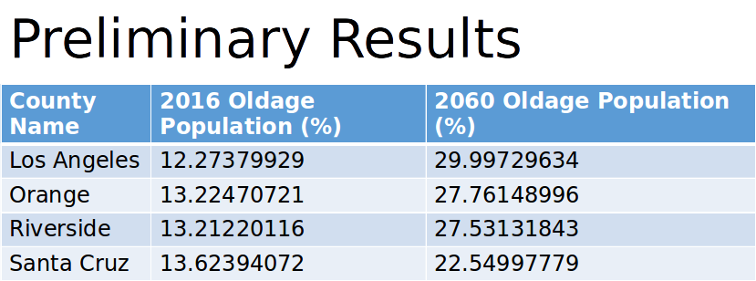
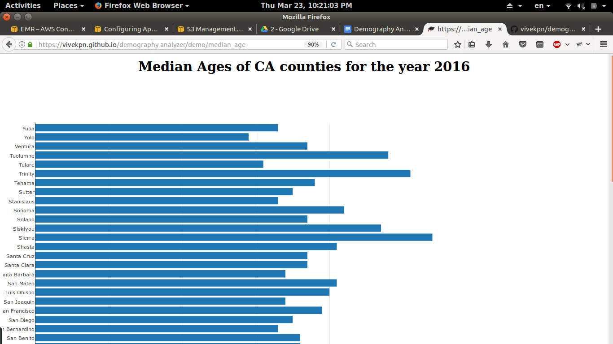
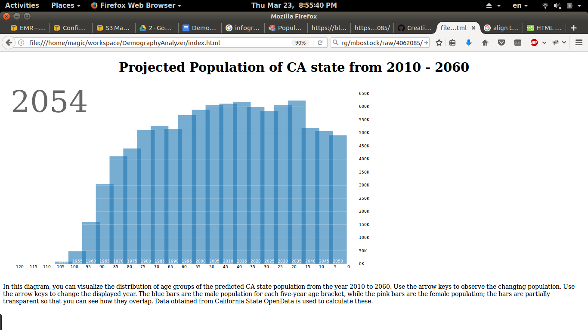
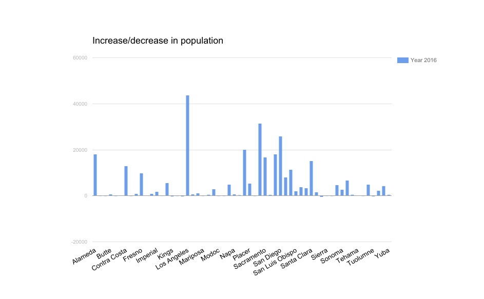

# Demography Analyzer

--------------

## Background: 

In this project, I have analyzed the demography of California state to find the following:

1. The county with fastest aging population.

2. Median age of each county from 2010 to 2060.

3. Predicting CA statewide total population age and gender wise.

4. County-wise change in population is calculated for an year.

5. Providing a infographics to visualize the data

The required data was gathered from Open Data portal of California[1] and United States census.[2] Processed the 2,099,650 records.  Each entry consisted county, age, gender, and ethnicity information. Population projections were based on 2016th population as a baseline. The projection data is available from the year 2017 to 2060. 

## Motivation: 

Understanding demography provides better insights for organizations. Business owners often require demographic information to use in the business plans for raising the funds. For businesses, it is easier and effective to target marketing to groups of people with similar characteristics over targeting to every individual. To give an example, health care products can target the county with aging population and cosmetics companies can look for the age group of 15 - 40. City governments can use this data for demographic specific planning such as construction of necessary schools, universities and recreational parks.

## Methods:

It is possible to process the entire demography data in a single node. It is not an absolute necessary to use MapReduce programming paradigm. However, analysing the census data is a good usecase to better understand and apply MapReduce. Hence, decided to use MapReduce programming paradigm to solve this problem.

## Implementation:

Each problem was solved separately. In the map phase, every entry is fetched and the data matching the filters only were passed to the reducer. In the reduce phase, the filtered data was processed depending on the query requirement.

1) County with the fastest aging population:

Age of 65 and above was considered as aged population during the analysis. County-wise sum of people matching this criteria was calculated at the reducer.

2) Median age of people in each county for an year:

The programmed to apply any filters such as ethnicity, year and gender. Median age was calculated by initially computing the total number of people present in the county and later by finding the half using cumulative sum of the sorted list.

3) CA statewide age, gender and year wise total population:

The data was divided based on age, gender and year in the mapper and in the reducer the data was added irrespective of the county it belonged to compute the total population.

4) County-wise change in population

The difference between the year the user is interested in to that of the previous year is calculated for all the counties in the reducer phase. Mapper phase takes care of filtering the data to match the query requirements.

5) Infographics

Infographics were developed using JavaScript, HTML and CSS. d3.js and plotly.js libraries were used to render the data.

## Local Setup:

* Configuring Apache Hadoop 2.7.3 for running MapReduce. 

* MongoDB for storing the data for the infographics/graphical user interface. 

* Eclipse was used an IDE. 

* The programs were written in Java.

* Infographics were written using HTML, JavaScript, and CSS.

## Remote Setup:

Amazon EC2 clusters along with EMR services were used for deploying and running the program on cloud. Amazon S3 is used for storing the input, output and execution files. Core Hadoop applications were installed on the nodes. m3.xlarge instance type was used. 1 instance of master node and 2 instances of core nodes were used. Executed MapReduce by using streaming program step as well as custom JAR step. 

Experimented with the number of reducers and mappers in two different ways. 

1. By configuring Hadoop while installing

*classification=mapred-site,properties=[mapreduce.tasktracker.reduce.tasks.maximum=1]*

2. Adding a bootstrap step.

*elastic-mapreduce --create \
 --name "cluster_name" \ -bootstrap-action="s3://elasticmapreduce/bootstrap-actions/configure-hadoop"  \
--args "-m,mapred.tasktracker.map.tasks.maximum=4,-m,mapred.tasktracker.reduce.tasks.maximum=2"
*

##### AWS configuration Screenshots: 

## Results: 

##### First Phase:

Created a database and stored the data as we need only a partial data for certain queries and having a database would help for fast processing for GUI.

*Figure 1 Content in the collection*

##### Second Phase:

1) Aging populations:

##### Infographics Screenshots:

2) Median age of CA counties

3) Projected population of CA from 2017-2060

In this diagram, you can visualize the distribution of age groups of the predicted CA state population from the year 2010 to 2060. This is an interactive infographic. The arrow keys can be used to observe the changing population. Using the arrow keys changes the displayed year. The bars represent the population.

4)  As it can be seen from the graph that for the year 2016, Los Angeles county had the highest influx of population which is more than 150% of the second highest Riverside. Orange county is also one of the fastest growing county only behind San Diego, Riverside and LA. 

These infographics are also available over the web.[3,4] The source code and output files are attached to the report. 

## References:

[1] [https://data.ca.gov/dataset/california-population-projection-county-age-gender-and-ethnicity](https://data.ca.gov/dataset/california-population-projection-county-age-gender-and-ethnicity)

[2] [https://www.census.gov/main/www/cen2000.html](https://www.census.gov/main/www/cen2000.html)

[3] [https://vivekpn.github.io/demography-analyzer/demo/median_age](https://vivekpn.github.io/demography-analyzer/demo/median_age)

[4] [https://vivekpn.github.io/demography-analyzer/demo/population](https://vivekpn.github.io/demography-analyzer/demo/population)

